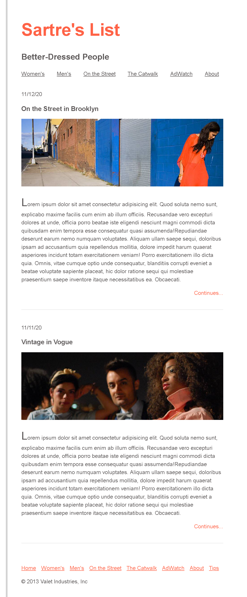

# Fashion Blog - React

This project is a React application created based on a provided mockup. The objective was to closely replicate the design and layout as specified in the given mockup, using React to bring the design to life.
This project first started with this HTML/CSS layout. Here is the link: [HTML/CSS Layout](https://github.com/homdahal997/Fashion-Blog-Html_CSS).
Watch live version of this html page here [HTML/CSS Layout Live](https://homdahal.me/Fashion-blog-html-css/)

Here is the live version of react  [React Layout Live](https://leafy-klepon-a5ea9c.netlify.app/)

https://leafy-klepon-a5ea9c.netlify.app/

## Project Overview

The Fashion Blog project is a demonstration of using React to build a web application that mimics a provided design mockup. This project showcases the ability to translate static designs into dynamic web pages, utilizing React components for structured and maintainable code.

## Mockups

The project was developed with reference to a given mockup, and the final product is a close representation of this initial design. Below are the mockups for this project:

- **Given Mockup**: 
- **Actual Product**: 

## Implementation Details

The application is structured into several React components, including but not limited to:

- `Header.jsx` for the website header.
- `Footer.jsx` for the website footer.
- `BlogPost.jsx` for individual blog posts.

These components are styled using CSS, with the main styles defined in `App.css` to ensure the final product closely matches the given mockup in terms of layout and aesthetics.

## How to View

To view the project:

1. Ensure you have Node.js and npm installed on your machine.
2. Clone or download the project repository to your local machine.
3. Navigate to the project directory in your terminal.
4. Run `npm install` to install the necessary dependencies.
5. Run `npm run dev` to start the development server.
6. Open your web browser and go to `http://localhost:5173` to view the project.

## Technologies Used

- React
- HTML5
- CSS3

